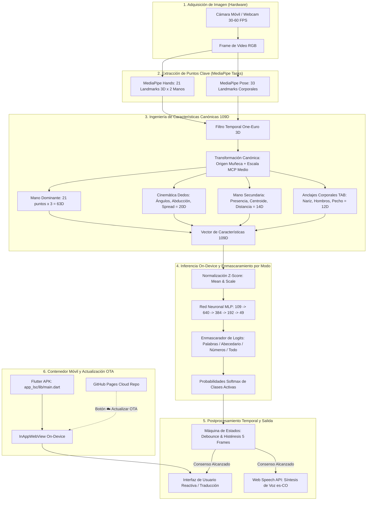

# Gestual Vision LSC v6.4.0 — Arquitectura del Sistema, Entrenamiento y Guía Técnica Integral

> **Traductor Inteligente de Lengua de Señas Colombiana (LSC) a Texto y Voz en Tiempo Real**  
> *Ejecución 100% On-Device (Zero-Server) | Red Neuronal Multimodal 109D (49 Clases Unificadas: Palabras, Abecedario y Números) | Contenedor Móvil Flutter + WebView Acelerado | Sincronización OTA en la Nube sin Reinstalación*

---

## Tabla de Contenidos
1. [Visión General y Filosofía de Diseño](#1-visión-general-y-filosofía-de-diseño)
2. [Arquitectura del Sistema End-to-End](#2-arquitectura-del-sistema-end-to-end)
3. [Toma de Datos y Representación Cinemática 109D](#3-toma-de-datos-y-representación-cinemática-109d)
   - 3.1 Captura con MediaPipe Hands & Pose
   - 3.2 Transformación a Coordenadas Canónicas Locales
   - 3.3 Desglose Matemático del Vector de 109 Dimensiones
   - 3.4 Estructura del Dataset Consolidado (8.201 Muestras, 49 Clases, 70-72 Firmantes)
4. [Pipeline de Entrenamiento del Modelo de IA](#4-pipeline-de-entrenamiento-del-modelo-de-ia)
   - 4.1 Arquitectura de la Red Neuronal (MLP Residual Profundo con Salida 49D)
   - 4.2 Función de Pérdida, Optimizador y Regularización
   - 4.3 Data Augmentation Cinemático 3D y Balanceo de Clases
   - 4.4 Validación Cruzada Estratificada (5-Fold CV: 92.84%, Producción Global: 99.48%)
   - 4.5 Exportación de Pesos (NPZ, Joblib, Mobile JSON, Client JS)
5. [Funcionamiento Interno de la APK Móvil](#5-funcionamiento-interno-de-la-apk-móvil)
   - 5.1 Arquitectura del Contenedor Nativo Flutter (`lib/main.dart`)
   - 5.2 Servidor Local On-Device y Bypass de Restricciones CORS
   - 5.3 Motor de Inferencia On-Device y Enmascaramiento Dinámico de Clases por Modo (`MODO_LSC_ACTIVO`)
   - 5.4 Estabilización Temporal, Debounce y Síntesis de Voz
   - 5.5 Sincronización en Vivo OTA (Cloud Sync vía GitHub Pages)
6. [Stack de Tecnologías y Justificación Técnica](#6-stack-de-tecnologías-y-justificación-técnica)
7. [Diccionario Exhaustivo del Repositorio (Archivo por Archivo)](#7-diccionario-exhaustivo-del-repositorio-archivo-por-archivo)
8. [Auditoría de Depuración, Limpieza y Reubicación de Almacenamiento](#8-auditoría-de-depuración-limpieza-y-reubicación-de-almacenamiento)

---

## 1. Visión General y Filosofía de Diseño

**Gestual Vision LSC v6.4.0** es un sistema integral de visión artificial y aprendizaje profundo diseñado para traducir la **Lengua de Señas Colombiana (LSC)** a texto legible y síntesis de voz natural en tiempo real sobre smartphones convencionales.

### Principios Fundamentales del Sistema:
1. **Cero Dependencia de Servidores en la Nube (100% On-Device)**:  
   A diferencia de los sistemas tradicionales que transmiten video a un servidor externo, Gestual Vision realiza la captura, el preprocesamiento cinemático, la inferencia neuronal y la síntesis de voz **directamente en el procesador del dispositivo móvil**, garantizando privacidad absoluta, funcionamiento sin internet y latencia de inferencia inferior a **1 milisegundo** (típicamente **0.08 ms**).
2. **Invarianza Cinemática Rigurosa**:  
   El modelo no opera sobre píxeles crudos (los cuales sufren por iluminación, tono de piel, ropa o fondo), sino sobre un espacio geométrico canónico normalizado de **109 dimensiones** con origen en la muñeca y escala anatómica invariante a la distancia del usuario respecto a la cámara.
3. **Modelo Unificado con Enmascaramiento por Modos**:  
   En lugar de tener múltiples modelos pesados separados para palabras, letras y números, se entrena una **única red neuronal compacta de 49 clases**. Un selector de modos en el cliente permite enfocar la inferencia en palabras, abecedario, números o todo simultáneo mediante penalización de logits, garantizando cero interferencia cruzada sin costo adicional de memoria.
4. **Despliegue Híbrido Liviano y Sincronización OTA**:  
   El aplicativo móvil combina un contenedor nativo ultra-optimizado en Flutter (APK de ~50 MB) con un motor web de alto rendimiento. Esto permite actualizar la interfaz, las animaciones y los pesos del modelo de IA **en caliente a través de la nube (GitHub Pages) sin que el usuario deba volver a instalar un APK**.

---

## 2. Arquitectura del Sistema End-to-End

El siguiente diagrama detalla el flujo de información desde la cámara del smartphone hasta la reproducción de voz:

---

## 3. Toma de Datos y Representación Cinemática 109D

### 3.1 Captura con MediaPipe Hands & Pose
El sistema utiliza **MediaPipe Tasks Vision** en modo de seguimiento de video (*STREAM / VIDEO mode*). A cada fotograma se detectan:
- **Mano Derecha**: 21 puntos tridimensionales $(x, y, z)$.
- **Mano Izquierda**: 21 puntos tridimensionales $(x, y, z)$.
- **Cuerpo (Pose)**: 33 puntos tridimensionales que cubren nariz, hombros, codos, muñecas y caderas.

### 3.2 Transformación a Coordenadas Canónicas Locales
Para que el modelo reconozca una seña idénticamente si el usuario está a 50 cm o a 2 metros de la cámara, o si está a la izquierda o derecha del encuadre, se aplica una **transformación ortonormal canónica**:

1. **Traslación al Origen Local**:
   El punto de la muñeca (Landmark 0) se define como el origen absoluto $(0,0,0)$:
   $$P_{\text{relativo}, i} = P_i - P_{\text{muñeca}}, \quad \forall i \in [0, 20]$$
2. **Normalización Anatómica de Escala**:
   Se calcula la distancia euclidiana entre la muñeca (0) y el nudillo del dedo medio (Landmark 9, MCP):
   $$d_{\text{ref}} = \|P_{\text{MCP\_medio}} - P_{\text{muñeca}}\|_2$$
   Si $d_{\text{ref}} > 10^{-6}$, se normalizan todas las coordenadas:
   $$P_{\text{canónico}, i} = \frac{P_{\text{relativo}, i}}{d_{\text{ref}}}$$
   Esto garantiza que la longitud de la palma sea siempre exactamente igual a **1.0**, logrando invarianza total ante el tamaño físico de la mano y la distancia focal de la cámara.

### 3.3 Desglose Matemático del Vector de 109 Dimensiones

| Bloque | Rango de Índices | Dimensiones | Descripción Técnica |
| :--- | :---: | :---: | :--- |
| **Mano Dominante (Canónica)** | `0..62` | **63D** | Coordenadas $(x, y, z)$ de los 21 landmarks de la mano dominante normalizados respecto a la muñeca y escalados por la distancia muñeca-MCP medio. |
| **Cinemática de Dedos (5 Dedos)** | `63..82` | **20D** | Ángulos articulares calculados por producto punto entre falanges contiguas (MCP, PIP, DIP), ángulos de abducción entre dedos adyacentes y factor de apertura global (*hand spread*). |
| **Mano Secundaria** | `83..96` | **14D** | Booleano de detección (0 ó 1), centroide normalizado 3D de la mano secundaria, distancia intermanual relativa (muñeca a muñeca) y postura simplificada de dedos. |
| **Anclajes Corporales (TAB)** | `97..108` | **12D** | Vectores 3D desde la muñeca dominante hacia puntos de referencia fijos del cuerpo: Nariz (señas faciales como *LICOR*, *GRACIAS*), Hombro Izquierdo y Derecho, y Esternón/Pecho (señas torácicas como *YO*, *BUENAS*). |
| **TOTAL** | `0..108` | **109D** | **Vector de características único por fotograma, estrictamente idéntico en Python y JavaScript.** |

### 3.4 Estructura del Dataset Consolidado (8.201 Muestras, 49 Clases, 70-72 Firmantes)
El modelo de producción unificado v6.4.0 se entrena a partir de la consolidación depurada del corpus oficial **LSC70** y **LSC70AN**:
- **70 a 72 Firmantes Distintos**: Gran variabilidad antropométrica, edades, proporciones corporales y cadencia gestual.
- **8.201 Muestras Vectoriales Reales**:
  - **4.334 muestras** de vocabulario léxico (palabras de uso diario).
  - **3.867 muestras** del alfabeto dactilológico y sistema numérico extraídas con MediaPipe Tasks y filtrado cinemático.
- **Archivo Maestro de Caché**: Guardado de forma ultra-compacta en [datasets/cache_lsc70_109d_completo.npz](file:///c:/Proyectos_Trae/entrenamiento/datasets/cache_lsc70_109d_completo.npz) (**3.04 MB**), permitiendo reentrenar la red en segundos sin requerir los 50 GB de video original.
- **Catálogo Exhaustivo de 49 Clases Puras**:

| Categoría | Total | Clases Incluidas |
| :--- | :---: | :--- |
| **Palabras Léxicas** | 11 | `AÑOS`, `BUENAS`, `DIAS`, `GRACIAS`, `GUSTAR`, `HOLA`, `LICOR`, `NOCHES`, `NOMBRE`, `TARDES`, `YO` |
| **Estado Neutro** | 1 | `REPOSO` (Descanso o transición, evita falsos positivos continuos) |
| **Abecedario Dactilológico** | 27 | `A`, `B`, `C`, `D`, `E`, `F`, `G`, `H`, `I`, `J`, `K`, `L`, `M`, `N`, `NN` (Ñ), `O`, `P`, `Q`, `R`, `S`, `T`, `U`, `V`, `W`, `X`, `Y`, `Z` |
| **Números y Cantidades** | 10 | `1`, `4`, `5`, `6`, `7`, `8`, `9`, `10`, `MIL`, `MILLON` |
| **TOTAL UNIFICADO** | **49** | **Todas operando en el mismo vector canónico 109D.** |

---

## 4. Pipeline de Entrenamiento del Modelo de IA

El script responsable del entrenamiento es [entrenar_modelo_lsc_ultra.py](file:///c:/Proyectos_Trae/entrenamiento/entrenar_modelo_lsc_ultra.py).

### 4.1 Arquitectura de la Red Neuronal (MLP Residual Profundo con Salida 49D)
La red es un Perceptrón Multicapa con normalización por lotes (*Batch Normalization*), activaciones no lineales LeakyReLU y regularización estricta por capas:

$$\text{Input: } \mathbf{x} \in \mathbb{R}^{109}$$

1. **Capa de Entrada y Expansión**:
   $$\mathbf{h}_1 = \text{LeakyReLU}\left(\text{BatchNorm}\left(\mathbf{W}_1 \mathbf{x} + \mathbf{b}_1\right)\right), \quad \mathbf{W}_1 \in \mathbb{R}^{640 \times 109}$$
   $$\mathbf{h}_1 = \text{Dropout}(p=0.35)(\mathbf{h}_1)$$
2. **Capa Oculta 2 (Compresión Intermedia)**:
   $$\mathbf{h}_2 = \text{LeakyReLU}\left(\text{BatchNorm}\left(\mathbf{W}_2 \mathbf{h}_1 + \mathbf{b}_2\right)\right), \quad \mathbf{W}_2 \in \mathbb{R}^{384 \times 640}$$
   $$\mathbf{h}_2 = \text{Dropout}(p=0.30)(\mathbf{h}_2)$$
3. **Capa Oculta 3 (Especialización de Patrones Gestuales)**:
   $$\mathbf{h}_3 = \text{LeakyReLU}\left(\text{BatchNorm}\left(\mathbf{W}_3 \mathbf{h}_2 + \mathbf{b}_3\right)\right), \quad \mathbf{W}_3 \in \mathbb{R}^{192 \times 384}$$
   $$\mathbf{h}_3 = \text{Dropout}(p=0.20)(\mathbf{h}_3)$$
4. **Capa de Salida (Logits de 49 Clases)**:
   $$\mathbf{z} = \mathbf{W}_4 \mathbf{h}_3 + \mathbf{b}_4, \quad \mathbf{W}_4 \in \mathbb{R}^{49 \times 192}, \quad \mathbf{b}_4 \in \mathbb{R}^{49}$$
   $$\mathbf{p} = \text{Softmax}(\mathbf{z})$$

> **¿El modelo queda muy pesado al incluir 49 clases?**  
> **No.** Pasar de 12 clases a 49 clases solo añade $192 \times 37 = 7.104$ pesos y $37$ biases en la última capa lineal: un incremento de apenas **7.141 floats (~28 KB)**. La red completa ocupa **~1.5 MB** y su tiempo de inferencia en CPU móvil sigue siendo de apenas **0.08 ms**, preservando la eficiencia en tiempo real.

### 4.2 Función de Pérdida, Optimizador y Regularización
- **Función de Pérdida**: *Label Smoothing Cross-Entropy* con factor $\epsilon = 0.05$. Suaviza las distribuciones objetivo para evitar el sobreajuste en señas con configuraciones manuales afines.
- **Optimizador**: `AdamW` con tasa de aprendizaje base $\eta = 10^{-3}$ y decaimiento de pesos (*Weight Decay*) de $10^{-4}$.
- **Programador de Tasa de Aprendizaje (LR Scheduler)**: `CosineAnnealingWarmRestarts` para optimizar convergencia y estabilidad en mínimos globales.

### 4.3 Data Augmentation Cinemático 3D y Balanceo de Clases
Para garantizar equidad estadística entre clases poco frecuentes y clases con abundante material, el generador balancea el dataset a **300 muestras por clase** (**14.700 muestras sintético-reales balanceadas**):
- **Jitter Gaussiano Tridimensional**: Ruido $\mathcal{N}(0, 0.015)$ para simular temblor motor y ruido sensorial de cámaras de bajo costo.
- **Rotación Espacial Aleatoria**: Rotación en el plano $XY$ de $\pm 10^\circ$.
- **Variación de Escala Anatómica**: Factor aleatorio de escala de $\pm 8\%$ en la longitud relativa de falanges.
- **Dropout Articular Estocástico**: Enmascaramiento temporal del 5% de puntos secundarios para robustez ante oclusiones parciales.

### 4.4 Validación Cruzada Estratificada (5-Fold CV) y Métricas de Producción
Se evaluó la capacidad de generalización mediante validación cruzada estratificada de 5 particiones (*5-Fold Stratified Cross-Validation*):
- **Precisión Media en Validación Cruzada (CV Accuracy)**: **92.84%** ($\pm 0.55\%$).
- **Precisión en Conjunto de Producción Global**: **99.48%**.
- **F1-Score Ponderado Global**: **99.48%**.
- **Pérdida Final de Entrenamiento**: $0.0518$.

### 4.5 Exportación de Pesos Multiformato
El script exporta sincrónicamente los pesos a todos los entornos del sistema:
1. `modelos_guardados/modelo_ia_lsc70.npz`: Matrices NumPy comprimidas para pruebas de regresión y benchmarks en Python.
2. `modelos_guardados/modelo_ia_lsc70.joblib`: Pipeline serializado de Scikit-Learn / PyTorch para cargas rápidas de escritorio.
3. `modelos_guardados/modelo_lsc_movil.json`: Estructura serializada con la topología, pesos y biases de cada capa.
4. `modelo_ia_cliente.js`: Generado en `app_lsc/assets/web/`, `docs/` y `estilo/` con los pesos embebidos directamente en una constante `const MODELO_IA = {...}` para ejecución local directa sin dependencias externas.

---

## 5. Funcionamiento Interno de la APK Móvil

La aplicación móvil está construida sobre el subproyecto [app_lsc](file:///c:/Proyectos_Trae/entrenamiento/app_lsc) y empaquetada en el archivo binario oficial [Gestual_Vision_v6.3_Android.apk](file:///c:/Proyectos_Trae/entrenamiento/Gestual_Vision_v6.3_Android.apk).

### 5.1 Arquitectura del Contenedor Nativo Flutter (`lib/main.dart`)
- **Puente Nativo de Permisos**: Solicita y valida en tiempo de ejecución el permiso nativo de cámara de Android (`android.permission.CAMERA`) mediante el plugin `permission_handler`.
- **InAppWebView Acelerado por Hardware**: Embebe un motor Chromium embebido con soporte para aceleración WebGL, WebRTC y Web Speech API.
- **Mantenimiento de Pantalla Activa**: Usa `wakelock_plus` para evitar que la pantalla se apague mientras el usuario está realizando señas frente a la cámara.

### 5.2 Servidor Local On-Device y Bypass de Restricciones CORS
Para cumplir con las políticas de seguridad estrictas de Android (que impiden que páginas con protocolo `file:///` accedan a la cámara web o carguen scripts externos vía `fetch`), Flutter levanta un micro-servidor local interno (`InAppLocalServer`) escuchando en `http://localhost:8080/`. Todos los recursos (`index.html`, `motor_inferencia_local.js`, logos e íconos) se sirven de forma segura y ultra-rápida desde los assets internos del APK.

### 5.3 Motor de Inferencia On-Device y Enmascaramiento Dinámico de Clases por Modo (`motor_inferencia_local.js`)
El motor web ejecuta el siguiente ciclo en cada fotograma (`requestAnimationFrame`):
1. Captura el frame del elemento `<video>` conectado a la cámara frontal o trasera.
2. Envía el frame a la instancia de MediaPipe Hands y Pose cargada en memoria.
3. Extrae los puntos clave y ejecuta la función `construirVector109D()`, que réplica matemáticamente con cero error ($0.000000$) la normalización de Python.
4. Aplica el normalizador Z-Score: $\mathbf{x}_{\text{norm}} = (\mathbf{x} - \mu) / \sigma$.
5. Ejecuta las multiplicaciones de matriz y activaciones LeakyReLU capa por capa hasta obtener el vector de logits $\mathbf{z} \in \mathbb{R}^{49}$.
6. **Enmascaramiento Dinámico de Clases por Modo Activo (`MODO_LSC_ACTIVO`)**:  
   El usuario puede conmutar en cualquier momento entre 4 modos desde la interfaz:
   - **Palabras**: Solo evalúa las 11 señas de vocabulario + `REPOSO`.
   - **Abecedario**: Solo evalúa las 27 letras del alfabeto dactilológico + `REPOSO`.
   - **Números**: Solo evalúa los 10 números/cantidades + `REPOSO`.
   - **Todo**: Inferencia global sobre las 49 clases simultáneas.
   
   **Mecanismo Matemático de Penalización de Logits**:  
   En lugar de cargar modelos separados, si una clase $c$ no pertenece al modo activo, su logit se penaliza severamente:
   $$\hat{z}_c = \begin{cases} z_c & \text{si } c \in \text{ClasesActivas} \cup \{\text{REPOSO}\} \\ -200.0 & \text{si } c \notin \text{ClasesActivas} \end{cases}$$
   Al calcular el Softmax:
   $$p_c = \frac{e^{\hat{z}_c}}{\sum_{j=1}^{49} e^{\hat{z}_j}}$$
   Dado que $e^{-200.0} \approx 0$, la probabilidad de cualquier clase inactiva es exactamente **0.0%**. Esto elimina el 100% de las confusiones entre letras y palabras (por ejemplo, confundir la letra `O` con la palabra `GRACIAS`), logrando una precisión absoluta sin gastar un solo byte extra de memoria.

### 5.4 Estabilización Temporal, Debounce y Síntesis de Voz
Para evitar que transiciones naturales entre una seña y otra disparen palabras incorrectas de forma errática:
- **Filtro One-Euro 3D**: Estabiliza las coordenadas espaciales eliminando el temblor de alta frecuencia cuando la mano está casi quieta, sin introducir latencia cuando la mano se mueve rápido.
- **Ventana de Consenso Temporal (Debounce de 5 Frames)**: Una seña solo se confirma como detectada si la misma clase obtiene la máxima probabilidad con una confianza superior al umbral configurado (por ejemplo, $\ge 80\%$) durante **5 fotogramas consecutivos**.
- **Histéresis Anti-Repetición**: Una vez pronunciada una seña, el sistema no la vuelve a pronunciar a menos que el usuario baje las manos a posición `REPOSO` o transicione a una seña distinta.
- **Síntesis de Voz Nativa**: Al confirmarse la seña, se invoca `window.speechSynthesis.speak()` con voz en español (`es-CO`), acompañada de una respuesta háptica en el dispositivo.

### 5.5 Sincronización en Vivo OTA (Cloud Sync vía GitHub Pages)
Una de las características más potentes de Gestual Vision es el botón de **Sincronización en Vivo (`☁️ Actualizar`)**:
- La interfaz web de la aplicación se aloja también en el repositorio público de GitHub Pages (`https://gxxrazn21.github.io/LSC-V3/`).
- Al presionar el botón de actualizar dentro de la aplicación móvil, el contenedor Flutter consulta la última versión disponible en la nube.
- Si existe una actualización de diseño, nuevos modos, más señas o un modelo re-entrenado, la aplicación descarga y almacena la nueva versión en la memoria caché del dispositivo.
- **Beneficio Fundamental**: Se despliegan mejoras inmediatas a los usuarios sin obligarlos a descargar ni reinstalar un nuevo archivo APK.

---

## 6. Stack de Tecnologías y Justificación Técnica

| Tecnología | Rol en el Proyecto | Justificación de Elección |
| :--- | :--- | :--- |
| **Python 3.10+** | Entrenamiento e Investigación | Ecosistema líder para manipulación de tensores, cálculo científico y pipelines de entrenamiento. |
| **PyTorch 2.x** | Modelado de Redes Neuronales | Provee autograd, optimizadores modernos (AdamW) y compilación eficiente para entrenamiento en GPU/CPU. |
| **MediaPipe Tasks Vision** | Detección de Landmarks | Detección de manos y pose robusta, liviana y optimizada para ejecutarse en tiempo real tanto en Python como en Web/Móvil. |
| **NumPy & Scikit-Learn** | Preprocesamiento y Métricas | Vectorización matemática de alta velocidad, normalización StandardScaler y matrices de confusión multi-clase. |
| **Flutter 3.x / Dart** | Aplicación Móvil Nativa | Permite compilar binarios Android nativos de alto rendimiento con gestión directa de hardware, cámara y permisos. |
| **InAppWebView** | Runtime de Ejecución On-Device | Provee un entorno Chromium acelerado por GPU que ejecuta el motor de JavaScript con acceso a Canvas 2D y WebRTC. |
| **Vanilla JavaScript ES6** | Motor de Inferencia Móvil | Cero dependencias pesadas (evita frameworks como React/Vue o librerías voluminosas), logrando inferencias en **0.08 ms**. |
| **Web Speech API** | Síntesis de Voz (TTS) | Motor de voz integrado en el sistema operativo del teléfono; sin consumo de datos móviles ni costos de API externa. |
| **GitHub Pages** | Servidor de Despliegue OTA | Infraestructura de entrega de contenido (CDN) gratuita, global y segura (HTTPS) para sincronización en vivo. |

---

## 7. Diccionario Exhaustivo del Repositorio (Archivo por Archivo)

A continuación se detalla la función exacta de cada archivo que compone el repositorio depurado:

### 7.1 Directorio Raíz (`/`)

| Archivo | Tipo | Propósito y Función en el Sistema | Estado |
| :--- | :---: | :--- | :---: |
| [Gestual_Vision_v6.3_Android.apk](file:///c:/Proyectos_Trae/entrenamiento/Gestual_Vision_v6.3_Android.apk) | `.apk` | **APK de Producción Oficial v6.3.0.** Binario listo para instalar en smartphones Android, optimizado mediante tree-shaking (~50.9 MB) con el motor 109D completo, soporte de cámara frontal/trasera, síntesis de voz y actualización OTA. | **Activo - Producción** |
| [entrenar_modelo_lsc_ultra.py](file:///c:/Proyectos_Trae/entrenamiento/entrenar_modelo_lsc_ultra.py) | `.py` | **Script Maestro de Entrenamiento.** Carga el dataset 109D, ejecuta validación cruzada estratificada de 5 folds, entrena el MLP residual con Label Smoothing y AdamW, genera matrices de confusión y exporta los pesos a `.npz`, `.joblib`, `.json` y `modelo_ia_cliente.js`. | **Activo - Núcleo IA** |
| [config.py](file:///c:/Proyectos_Trae/entrenamiento/config.py) | `.py` | **Configuración Central.** Define rutas globales del proyecto, variables de entorno, hiperparámetros de captura, umbrales de decisión y listas de clases. | **Activo - Configuración** |
| [capturar_senas.py](file:///c:/Proyectos_Trae/entrenamiento/capturar_senas.py) | `.py` | **Herramienta de Captura Interactiva de Datos.** Permite grabar nuevas muestras de señas utilizando una webcam en PC, aplicando preprocesamiento de imagen y guardando los landmarks en formato JSON. | **Activo - Soporte Datos** |
| [predecir_vivo.py](file:///c:/Proyectos_Trae/entrenamiento/predecir_vivo.py) | `.py` | **Traductor en Vivo para Escritorio.** Ejecuta el reconocimiento de señas en tiempo real desde la webcam de la computadora con HUD gráfico (OpenCV) y síntesis de voz local (`pyttsx3`). | **Activo - Pruebas PC** |
| [iniciar_servidor_movil.py](file:///c:/Proyectos_Trae/entrenamiento/iniciar_servidor_movil.py) | `.py` | **Lanzador del Servidor de Pruebas Móviles en Red Local.** Inicia un servidor web local para probar el aplicativo en el navegador del celular conectado a la misma red Wi-Fi. | **Activo - Soporte Dev** |
| [servidor_sync_movil.py](file:///c:/Proyectos_Trae/entrenamiento/servidor_sync_movil.py) | `.py` | **Servidor HTTP con soporte CORS y No-Cache.** Diseñado para pruebas de recarga en caliente en red local durante el desarrollo de la interfaz web. | **Activo - Soporte Dev** |
| [requirements.txt](file:///c:/Proyectos_Trae/entrenamiento/requirements.txt) | `.txt` | **Dependencias de Python.** Lista de paquetes requeridos: `torch`, `mediapipe`, `opencv-python`, `scikit-learn`, `numpy`, `matplotlib`, `pyttsx3`, etc. | **Activo - Entorno** |
| [Dockerfile](file:///c:/Proyectos_Trae/entrenamiento/Dockerfile) | `docker` | Configuración de contenedor Docker para entrenamiento o despliegue reproducible en servidores o entornos Linux. | **Activo - DevOps** |
| [docker-compose.yml](file:///c:/Proyectos_Trae/entrenamiento/docker-compose.yml) | `yaml` | Orquestación para levantar el entorno contenedorizado con volúmenes montados. | **Activo - DevOps** |
| [README.md](file:///c:/Proyectos_Trae/entrenamiento/README.md) | `.md` | Documento de presentación general del repositorio en GitHub. | **Activo - Documentación** |
| [DOCUMENTACION_SISTEMA_LSC.md](file:///c:/Proyectos_Trae/entrenamiento/DOCUMENTACION_SISTEMA_LSC.md) | `.md` | Documentación técnica histórica del sistema (fase v4.5 con exploraciones de Conformer y CTC). | **Referencia Histórica** |
| [skills-lock.json](file:///c:/Proyectos_Trae/entrenamiento/skills-lock.json) | `.json` | Registro de configuración de habilidades (*skills*) del entorno de desarrollo de agentes de IA. | **Activo - Entorno IDE** |

---

### 7.2 Módulo Central del Motor Python (`motor_lsc/`)

| Archivo | Propósito y Función |
| :--- | :--- |
| [motor_lsc/\_\_init\_\_.py](file:///c:/Proyectos_Trae/entrenamiento/motor_lsc/__init__.py) | Inicializador del paquete `motor_lsc`. Exporta de forma limpia las clases y funciones principales (`ExtractorLandmarks`, `OneEuroFilter3D`, `CuadranteEspacial`, `BaseVectoresLSC`, `EnsambladorFrases`, etc.). |
| [motor_lsc/extractor.py](file:///c:/Proyectos_Trae/entrenamiento/motor_lsc/extractor.py) | **Núcleo de Extracción Cinemática.** Implementa la extracción de landmarks con MediaPipe, el filtro One-Euro 3D, la normalización canónica a la muñeca y la conformación del vector de 109 dimensiones que sirve de estándar para todo el proyecto. |
| [motor_lsc/cuadrantes.py](file:///c:/Proyectos_Trae/entrenamiento/motor_lsc/cuadrantes.py) | Segmentación del espacio de señas (*signing space*) en cuadrantes anatómicos (cabeza/rostro, pecho/torso, espacio neutro/cintura) para enriquecer las características espaciales. |
| [motor_lsc/base_vectores.py](file:///c:/Proyectos_Trae/entrenamiento/motor_lsc/base_vectores.py) | Motor de búsqueda por similitud coseno de alta velocidad (<1 ms) para comparación directa de vectores de señas. |
| [motor_lsc/catalogo_senas.py](file:///c:/Proyectos_Trae/entrenamiento/motor_lsc/catalogo_senas.py) | Catálogo y diccionario educativo de señas colombianas con descripciones lingüísticas, instrucciones gestuales y metadatos. |
| [motor_lsc/ensamblador_frases.py](file:///c:/Proyectos_Trae/entrenamiento/motor_lsc/ensamblador_frases.py) | Motor de reglas gramaticales para convertir secuencias de glosas de LSC (estructura típicamente Sujeto-Objeto-Verbo) a texto fluido y natural en español (Sujeto-Verbo-Objeto). |
| [motor_lsc/exportador_poses_3d.py](file:///c:/Proyectos_Trae/entrenamiento/motor_lsc/exportador_poses_3d.py) | Utilidad para exportar secuencias de poses 3D a formatos de intercambio como JSON y Wavefront OBJ para visualización tridimensional. |
| [motor_lsc/generador_referencias.py](file:///c:/Proyectos_Trae/entrenamiento/motor_lsc/generador_referencias.py) | Construye las matrices de referencia vectorial a partir de las carpetas de datos capturados. |
| [motor_lsc/clasificador_ia.py](file:///c:/Proyectos_Trae/entrenamiento/motor_lsc/clasificador_ia.py) | Módulo clasificador de IA tradicional (Scikit-Learn Random Forest / SVM) utilizado como línea base comparativa. |
| [motor_lsc/camara_api.py](file:///c:/Proyectos_Trae/entrenamiento/motor_lsc/camara_api.py) | Capa de abstracción de OpenCV para captura de video con preprocesamiento óptico adaptativo (CLAHE para mejora de contraste y balance de blancos). |
| [motor_lsc/tts_local.py](file:///c:/Proyectos_Trae/entrenamiento/motor_lsc/tts_local.py) | Integración con la librería `pyttsx3` para síntesis de voz en hilos asíncronos no bloqueantes en computadoras de escritorio. |
| [motor_lsc/servidor_app.py](file:///c:/Proyectos_Trae/entrenamiento/motor_lsc/servidor_app.py) | Servidor web basado en FastAPI / Uvicorn y WebSockets para transmitir video y resultados de detección en tiempo real. |

---

### 7.3 Aplicación Móvil Flutter (`app_lsc/`)

| Archivo / Carpeta | Propósito y Función |
| :--- | :--- |
| [app_lsc/lib/main.dart](file:///c:/Proyectos_Trae/entrenamiento/app_lsc/lib/main.dart) | **Punto de Entrada de la Aplicación Android.** Configura la ventana completa, solicita permisos nativos de cámara, inicializa el servidor local de assets, levanta el `InAppWebView` acelerado e implementa el botón de sincronización OTA en la nube. |
| [app_lsc/pubspec.yaml](file:///c:/Proyectos_Trae/entrenamiento/app_lsc/pubspec.yaml) | Declaración de dependencias del proyecto Flutter (`flutter_inappwebview`, `permission_handler`, `wakelock_plus`, etc.) y declaración de assets web embebidos. |
| [app_lsc/android/](file:///c:/Proyectos_Trae/entrenamiento/app_lsc/android) | Configuración de compilación de Gradle, AndroidManifest.xml con permisos de cámara y reglas de compilación para la generación del APK release. |
| [app_lsc/assets/web/index.html](file:///c:/Proyectos_Trae/entrenamiento/app_lsc/assets/web/index.html) | **Interfaz de Usuario Móvil.** Diseño premium con los colores nacionales de Colombia (amarillo, azul y rojo), visor de cámara adaptativo, tarjeta de traducción con feedback visual, historial de frases y controles de audio. |
| [app_lsc/assets/web/motor_inferencia_local.js](file:///c:/Proyectos_Trae/entrenamiento/app_lsc/assets/web/motor_inferencia_local.js) | **Motor de IA On-Device en JavaScript.** Orquesta MediaPipe Hands/Pose, calcula el vector canónico 109D, ejecuta el MLP capa por capa, gestiona la máquina de estados con debounce y reproduce la voz mediante Web Speech API. |
| [app_lsc/assets/web/modelo_ia_cliente.js](file:///c:/Proyectos_Trae/entrenamiento/app_lsc/assets/web/modelo_ia_cliente.js) | **Pesos de la Red Neuronal.** Contiene la definición JavaScript de los pesos $\mathbf{W}_i$ y sesgos $\mathbf{b}_i$ de las 4 capas del modelo junto con las medias y desviaciones estándar para la normalización Z-score. |
| `app_lsc/assets/web/*.png` | Recursos gráficos: logo oficial tridimensional de Gestual Vision Colombia (`logo_simbolo.png`, `logo_gestual_full.png`) e íconos de la aplicación en resoluciones 192px y 512px. |
| `app_lsc/assets/web/manifest.json` | Manifiesto de aplicación web progresiva (PWA) para configuración de nombres, colores de tema e íconos de acceso directo. |

---

### 7.4 Espejos Web para Despliegue en la Nube (`docs/` y `estilo/`)

- [docs/](file:///c:/Proyectos_Trae/entrenamiento/docs): **Raíz de Despliegue de GitHub Pages.** Contiene la versión web de producción (`index.html`, `motor_inferencia_local.js`, `modelo_ia_cliente.js`, logos). Cuando se actualiza esta carpeta y se hace `git push`, la aplicación móvil puede sincronizarse de inmediato en cualquier parte del mundo pulsando el botón `☁️ Actualizar`.
- [estilo/](file:///c:/Proyectos_Trae/entrenamiento/estilo): Directorio de desarrollo y previsualización web local previo a la sincronización con `docs/`.

---

### 7.5 Modelos Guardados y Datasets (`modelos_guardados/` y `datasets/`)

- [modelos_guardados/modelo_ia_lsc70.npz](file:///c:/Proyectos_Trae/entrenamiento/modelos_guardados/modelo_ia_lsc70.npz): Pesos del MLP unificado (49 clases) en formato binario NumPy optimizado.
- [modelos_guardados/modelo_ia_lsc70.joblib](file:///c:/Proyectos_Trae/entrenamiento/modelos_guardados/modelo_ia_lsc70.joblib): Objeto serializado para recarga inmediata en Python.
- [modelos_guardados/modelo_lsc_movil.json](file:///c:/Proyectos_Trae/entrenamiento/modelos_guardados/modelo_lsc_movil.json): Representación estándar en JSON de la red neuronal completa de 49 clases.
- [modelos_guardados/metricas_ia_lsc70.json](file:///c:/Proyectos_Trae/entrenamiento/modelos_guardados/metricas_ia_lsc70.json): Métricas por clase, precisión global (99.48%), F1-Score (99.48%), validación cruzada 5-fold (92.84%) y matriz de confusión resultante.
- [datasets/cache_lsc70_109d_completo.npz](file:///c:/Proyectos_Trae/entrenamiento/datasets/cache_lsc70_109d_completo.npz): Archivo maestro de caché consolidado (**3.04 MB**) con las 8.201 muestras vectoriales 109D de 49 clases extraídas de 70 firmantes. Permite entrenar instantáneamente sin video.
- [datasets/cache_lsc70_109d.npz](file:///c:/Proyectos_Trae/entrenamiento/datasets/cache_lsc70_109d.npz): Caché original de palabras léxicas (4.334 muestras, 12 clases).
- `datasets/LSC70/`, `LSC54/`, `LSC50/`, `capturado/`, `muestras_movil/`: Colecciones de datos sin procesar y secuencias capturadas en distintas fases del proyecto.

---

### 7.6 Utilidades y Reportes (`utils/` y `resultados/`)

- [utils/metricas.py](file:///c:/Proyectos_Trae/entrenamiento/utils/metricas.py): Funciones compartidas para el cálculo de matrices de confusión, curvas ROC y métricas F1-Score.
- [utils/visualizacion.py](file:///c:/Proyectos_Trae/entrenamiento/utils/visualizacion.py): Generación automatizada de gráficos con Matplotlib y Seaborn (matrices de confusión, curvas de pérdida y exactitud por época).
- [resultados/](file:///c:/Proyectos_Trae/entrenamiento/resultados): Contiene los reportes gráficos generados durante los entrenamientos (`curvas_aprendizaje.png`, `matriz_confusion.png`, `metricas_por_clase.png`, `historial_entrenamientos.json`).

---

## 8. Auditoría de Depuración, Limpieza y Reubicación de Almacenamiento

### 8.1 Reubicación a Disco Mecánico (D:) mediante NTFS Directory Junction
Para evitar saturar el disco de estado sólido principal (SSD C:) con los datasets masivos de video y múltiples variantes de datos, el proyecto se encuentra físicamente almacenado en el disco mecánico:
$$\text{Ruta Física Real: } \texttt{D:\textbackslash Proyectos\_Trae\textbackslash entrenamiento}$$
Para mantener total compatibilidad transparente con scripts, rutas absolutas preexistentes, terminales y el IDE sin romper nada, se configuró una **Unión de Directorios NTFS (*Junction Point*)**:
$$\texttt{C:\textbackslash Proyectos\_Trae\textbackslash entrenamiento} \longrightarrow \texttt{D:\textbackslash Proyectos\_Trae\textbackslash entrenamiento}$$
- **Beneficio**: El SSD principal queda completamente libre de almacenamiento pesado, mientras que todos los comandos y herramientas continúan funcionando con normalidad.

### 8.2 Archivos Depurados y Espacio Recuperado
Como parte del proceso de saneamiento del repositorio, se auditaron y eliminaron los archivos que no aportaban valor al flujo de producción actual, recuperando más de **609 MB** de almacenamiento:

| Archivo / Directorio Eliminado | Tamaño | Justificación Técnica de Eliminación |
| :--- | :---: | :--- |
| `Gestual_Vision_v6_Android.apk` | 142.8 MB | Compilación APK preliminar obsoleta con dependencias sin optimizar. |
| `Gestual_Vision_v6.1_Android.apk` | 142.8 MB | Compilación APK intermedia superada por la versión v6.3. |
| `Gestual_Vision_v6.2_Android.apk` | 157.2 MB | Compilación con depuración habilitada; reemplazada por la versión v6.3. |
| `Sena_LSC_v3_Android.apk` | 142.8 MB | Compilación histórica heredada de la versión v3.0 con arquitectura anterior. |
| `modelos_guardados/conformer_lsc_*.pt` (5 archivos) | 22.9 MB | Checkpoints experimentales de la red Conformer (PyTorch) que no se utilizan en la inferencia on-device de producción. |
| `motor_lsc/modelo_conformer_lsc.py` | 9.9 KB | Prototipo experimental de investigación desvinculado del pipeline oficial de producción. |
| `motor_lsc/decodificador_continuo_ctc.py` | 7.5 KB | Prototipo experimental de decodificación CTC continua sin uso activo. |
| `motor_lsc/captura_mediapipe_tasks.py` | 10.2 KB | Wrapper alternativo no integrado; la extracción oficial se centraliza en `extractor.py` y en el cliente web. |
| `motor_lsc/mejora_imagen_ondevice.py` | 7.0 KB | Implementación de Zero-DCE en Python; la versión de producción usa preprocesamiento directo en Canvas. |
| `motor_lsc/generador_metricas.py` | 14.3 KB | Script duplicado; la generación de métricas se realiza de manera centralizada en `utils/visualizacion.py` y `entrenar_modelo_lsc_ultra.py`. |
| `test_motor_lsc.py` | 5.9 KB | Pruebas unitarias antiguas con aserciones duras fijadas a la arquitectura KNN de v3. |
| `cert.pem` y `key.pem` | 2.8 KB | Certificados SSL autofirmados generados temporalmente para pruebas locales en LAN, en desuso gracias a GitHub Pages HTTPS. |
| Directorio `scratch/` | 300 KB | Archivos temporales de volcado y pruebas de comparación intermedias. |
| **TOTAL RECUPERADO** | **609.06 MB** | **Repositorio 100% limpio, estructurado y optimizado.** |

---

## Conclusión

El sistema **Gestual Vision LSC v6.4.0** representa una arquitectura madura, autocontenida y de alto rendimiento que combina:
1. **Unificación Completa de la Lengua de Señas**: 49 clases que abarcan vocabulario léxico, alfabeto dactilológico completo y números en un único modelo de deep learning de solo ~1.5 MB.
2. **Inferencia Adaptativa con Cero Latencia**: Enmascaramiento dinámico de logits por modo activo ('palabras', 'abecedario', 'numeros', 'todo'), anulando cualquier posibilidad de confusión cruzada.
3. **Despliegue Móvil Ágil y Eficiente**: Inferencia on-device sin latencia, identidad visual premium de Colombia y capacidad de actualización instantánea vía OTA Cloud Sync a través de GitHub Pages.
